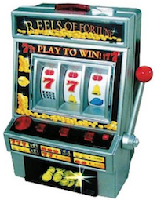
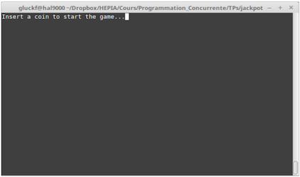
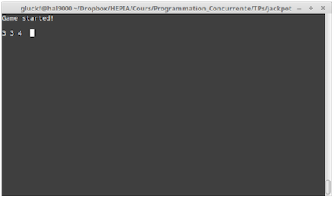
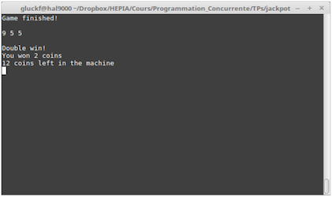

# Programmation Concurrente
## *Jeu du Jackpot*
## Travail Pratique

### But du projet
Le but de ce travail pratique est d’écrire un programme modélisant une machine à sous de type « Jackpot » (voir Figure 1) telles que celles que l’on peut trouver dans les casinos et autres salles de jeux. L’objectif est de vous familiariser avec les variables de condition et les signaux.

<center>  </center>
<center> *Figure 1: Jeu du Jackpot* </center>

### Déroulement du jeu
Toute partie de jeu débute par l’introduction d’une pièce dans la machine. Cette action est simulée par le signal SIGTSTP. Le but du jeu consiste alors à arrêter chaque roue de la machine afin que celles-ci affichent toutes le même symbole. Le bouton stop permet de stopper la roue courante. La pression sur ce bouton est simulée par le signal SIGINT. Les roues affichent des nombres croissants allant de 0 à 9 à des vitesses différentes. Si deux roues affichent la même valeur, le joueur gagne le double de la mise (deux pièces). Si trois roues affichent la même valeur, le joueur emporte la moitié des pièces se trouvant dans la caisse de la machine (arrondi à l’entier inférieur).

#### Affichage et interface de contrôle

<br> **Affichage :**

• Une fois le jeu lancé, le message « Insert a coin to start the game... » est affiché, comme illustré en Figure 2.

• Une fois une pièce introduite, le message « Game started! » est affiché et les roues sont affichées côte à côte sur la même ligne. Le symbole de chaque roue défile à une vitesse propre. La partie en cours est illustrée en Figure 2.

• Lorsque la partie est terminée, le message « Game finished! » est affiché ainsi que les informations ci-dessous, comme illustré en Figure 4 :

1. L’état des roues (qui devrait déjà être affiché).

2. Le résultat de la partie : <br>
• « JACKPOT! » si trois roues ont la même valeur ; <br>
• « Double win! » si deux roues ont la même valeur ; <br>
• « You lost! » si moins de deux roues ont la même valeur ;

3. Le gain obtenu, par exemple « You won 2 coins ».

4. Le nombre de pièces restantes en caisse, par exemple « 12 coins left in the machine ».

• Les informations précédentes restent affichées pendant 5 secondes avant que l’écran s’efface et que le jeu se retrouve à l’état initial en attente d’une pièce, comme illustré en Figure 2.

<center>  </center>
<center> *Figure 2: En attente d’une pièce pour commencer la partie* </center>
<br>
<center>  </center>
<center> *Figure 3: Jeu en cours* </center>
<br>
<center>  </center>
<center> *Figure 4: Partie terminée* </center>
<br>

**Interface de contrôle :**

• L'introduction d’une pièce est simulée par le signal SIGTSTP (ctrl-z). Au moment où la pièce est insérée, le jeu démarre. Si une pièce est insérée en milieu de jeu, celui-ci est alors redémarré.

• La pression du bouton permettant de stopper la roue courante est simulée par le signal SIGINT (ctrl-c). A chaque pression du bouton, la roue courante est stoppée. Les roues sont stoppées les unes après les autres dans l’ordre, de gauche à droite. Si le joueur ne stoppe pas la roue courante, celle-ci se stoppe automatiquement toute seule après 3 secondes.

• Le signal SIGQUIT (ctrl-\\) permet de sortir **proprement** du jeu, à n’importe quel moment (sauf pendant les 5 secondes d’attente en fin de partie). Le message « Come again soon » est alors affiché et le programme se termine.

#### Cahier des charges

• Au minimum, cinq threads doivent être créés : un par roue, un pour l’affichage, et un comme contrôleur.

• Chaque thread roue s’occupe uniquement de calculer la nouvelle valeur de la roue avec le bon timing. Lorsqu’une roue est arrêtée, le thread correspondant doit être bloqué en attente passive.

• Le thread d’affichage est le seul endroit dans le code où un affichage est réalisé.

• Les roues changent leur chiffre à des vitesses différentes : toutes les 120ms pour la première roue, 60ms pour la deuxième, et 30ms pour la troisième.

• L’affichage des roues a lieu à une fréquence de 30 Hz.

• Le montant initial de la caisse est de 10 pièces.

• Si le joueur gagne une partie (double mise ou jackpot), le montant gagné doit bien sûr être retiré du coffre de la machine. Si le montant gagné dépasse celui de la caisse, seul le solde de la caisse est versé.

• **Les seules primitives de communication autorisées sont les variables de condition, mutex et signaux.**

• La sortie du programme avec le signal SIGQUIT (ctrl-\) doit être **propre** : la mémoire éventuellement allouée doit être désallouée correctement.

• Écrivez un code générique, de façon à ce qu’il soit par exemple possible d’augmenter le nombre de roues avec une constante. De même, le montant initial de la caisse, les timings, les symboles des roues, etc. doivent être représentés par des constantes.

• Aucune variable globale n’est autorisée. A noter qu’il est permis d’utiliser des constantes globales (déclarées via la directive `#define` ou le mot-clé `const`).

• Il n’est pas autorisé d’utiliser l’API d’annulation des threads (`pthread_cancel`, etc.).

• Enfin et comme toujours, toute attente active est prohibée.

#### Informations utiles

##### Affichage
Vous utiliserez les codes de contrôle ANSI pour manipuler l’affichage dans le terminal, afin de pouvoir effacer l’écran et déplacer le curseur :

• Pour effacer le contenu du terminal : `printf("\e[2J");`

• Pour déplacer le curseur à la ligne 7 et colonne 13 : `printf("\e[7;13H");`

Pour plus de détails, voir https://en.wikipedia.org/wiki/ANSI_escape_code Pensez à « débuffériser » la sortie standard avec l’appel à `setbuf(stdout,0)`, sinon toute ligne
affichée sans retour chariot (‘\n’) ne sera pas affichée.

##### Timing
Les mesures de timing peuvent être effectuées avec la fonction `clock_gettime` de la librairie
`<time.h>` comme montré ci-dessous :

````
struct timespec start, finish;
clock_gettime(CLOCK_MONOTONIC, &start);
...
// code à mesurer
clock_gettime(CLOCK_MONOTONIC, &finish);
double elapsed = finish.tv_sec - start.tv_sec;
elapsed += (finish.tv_nsec - start.tv_nsec) / 1000000000.0;
````

**Important** : le code ci-dessus requiert la librairie rt. Pour ce faire, passez `-lrt` au compilateur
`gcc` au moment où vous générez votre exécutable final.

#### Travail à rendre
N’oubliez pas de lire attentivement le document « *Consignes Travaux Pratiques.pdf* » disponible sur la page CyberLearn du cours.
Pour ce travail pratique, vous me rendrez le code source complet du projet ainsi qu’un rapport sur le travail réalisé. Chaque groupe me rendra une archive contenant les fichiers suivants :

• Les fichiers sources, incluant un makefile pour compiler le projet (et faire le ménage).

• Le rapport au format PDF.
Le code doit respecter les consignes décrites dans le document « *Consignes pour l’écriture du code* » et le rapport doit respecter les consignes décrites dans le document « *Consignes Travaux Pratiques.pdf* ». Ces deux documents se trouvent sur la page CyberLearn du cours.
